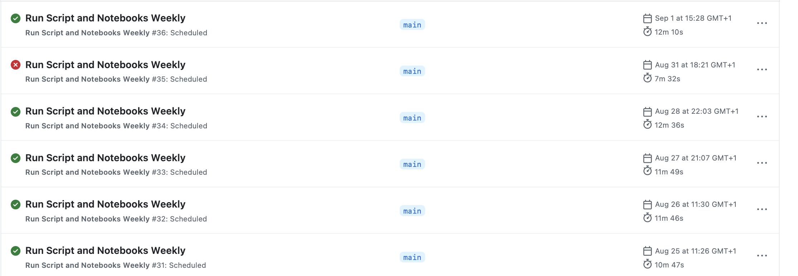
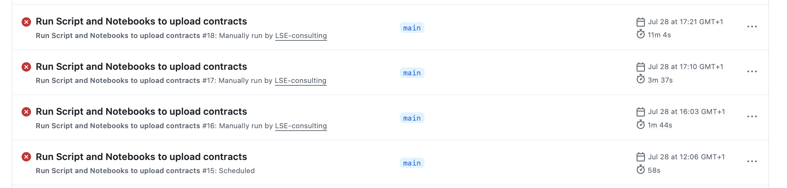

# Unified Contract Database Pipeline

This repository runs an automated pipeline that checks eight public tender and contract websites every weekday morning, filters them down to the work relevant to LSE Consulting, and adds new opportunities to the shared Notion database. It also runs a daily tidy-up that marks contracts as **Expired** once their closing date has passed.

You do not need to read or change any code to operate this pipeline. This document covers what runs, when it runs, how to change that, and what to do when something goes wrong.

## Contents

1. [Repository structure](#repository-structure)
2. [Sources](#sources)
3. [When it runs](#when-it-runs)
4. [Checking a run](#checking-a-run)
5. [Reading the run history](#reading-the-run-history)
6. [When something goes wrong](#when-something-goes-wrong)
7. [Changing the schedule](#changing-the-schedule)
8. [GitHub Actions minutes and cost](#github-actions-minutes-and-cost)
9. [The Notion connection](#the-notion-connection)
10. [Adding a new source](#adding-a-new-source)
11. [Escalating to a developer](#escalating-to-a-developer)

---

## Repository structure

| Path | Purpose |
|---|---|
| `.github/workflows/schedule-notebooks.yml` | The schedule. Defines what runs, in what order, and when. The only file that controls timing. |
| `Sources/` | One folder per website. Each folder is self-contained. |
| `Sources/blocked_words.py` | Shared keyword blocklist. Applies to all eight sources. |
| `Sources/<website>/` | That website's notebook, plus its record of past uploads. Each folder has its own README. |
| `Sources/<website>/*.ipynb` | The notebook that fetches, filters and uploads for that website. |
| `Sources/<website>/*contract_titles.csv` | Every contract title already uploaded from that website. Prevents duplicates. Updated automatically after each run. |
| `Sources/UK Contracts/api_filtered_contracts.py` | Extra fetch step used by UK Contracts Finder only. Runs immediately before that source's notebook. |
| `Sources/UK Contracts/output_data.json` | Holds the results of the fetch step above until the notebook reads them. Overwritten each run. |
| `Sources/EU Contracts/ted_api_output.json` | Raw API response from the last TED run, kept for reference. |
| `Shared/Expired_Contracts_Update.ipynb` | Works across the whole Notion database rather than one website. Marks past-deadline contracts as Expired. |
| `docs/images/` | Screenshots used in this document. |

### `Sources/blocked_words.py`

A single list of keywords that will always exclude a notice, whichever website it came from. It covers categories of work the team does not bid for: landscaping, furniture, construction, workwear, logistics, operations, tours, marketing, sewage and waste disposal.

Every notebook reads this one file, so editing the list here changes the behaviour of all eight sources on the next run. No other files need touching.

How the matching works:

- Checked against both the **title** and the **description** of each notice
- Not case sensitive
- Whole words only, so `tour` will not match `tourism`
- Multi-word phrases such as `waste disposal` still match across line breaks and extra spaces

Some terms are deliberately broad (`operational`, `marketing`, `tour`, `logistics`, `construction`) and will occasionally exclude legitimate work. Every skipped notice is printed in the run log along with the keyword that caused it, so if too much is being filtered out, read the log and narrow the specific term to a phrase.

### The CSV files

Each source folder holds a CSV listing every contract title already uploaded from that website. Before uploading, the notebook checks the title against this list and skips anything already there. After a successful upload, the new title is added and the file is committed back to this repository.

**Do not delete these files.** If one is lost, the next run will treat every currently listed opportunity as new and re-upload the lot, creating duplicates in Notion.

---

## Sources

| Folder | Website | What is pulled |
|---|---|---|
| `Sources/UK Contracts` | [UK Contracts Finder](https://www.contractsfinder.service.gov.uk) | Open UK public sector contracts in the target consultancy and research categories |
| `Sources/Find a Tender` | [Find a Tender Service](https://www.find-tender.service.gov.uk/) | Higher-value UK public sector contracts, pre-award notices only |
| `Sources/EU Contracts` | [TED (Tenders Electronic Daily)](https://ted.europa.eu/) | EU-wide tender notices, English only |
| `Sources/EU Commission` | [EU Funding and Tenders Portal](https://ec.europa.eu/info/funding-tenders/opportunities/portal/screen/opportunities/calls-for-tenders) | Calls for tenders issued directly by EU institutions |
| `Sources/UNGM` | [UN Global Marketplace](https://www.ungm.org/Public/Notice) | UN agency procurement notices, English only |
| `Sources/World Bank` | [World Bank Business Opportunities](https://projects.worldbank.org/en/projects-operations/opportunities) | Consultant Services opportunities, English only |
| `Sources/IDB` | [Inter-American Development Bank](https://data.iadb.org/dataset/project-procurement-bidding-notices-and-notification-of-contract-awards) | Consultancy notices, English and Spanish |
| `Sources/Council of Europe` | [Council of Europe eProc](https://eproc.coe.int/callfortenders-list) | Live calls for tenders, English and Spanish |

Each folder's README sets out that source's filters, quirks and known gaps in detail. The notebook itself opens with the same summary.

---

## When it runs

| When | What happens |
|---|---|
| Weekdays at 10:00 UTC | All eight sources run in order, then the expiry update |
| Saturdays and Sundays | Nothing runs |
| On demand | Anyone with repository access can start a run manually |

Times are set in **UTC**, not UK time. Between late March and late October the UK is one hour ahead, so the 10:00 UTC run happens at 11:00 UK time. In winter the two are the same.

A full run takes roughly 10 to 13 minutes.

Scheduled runs are queued rather than guaranteed. Starting 5 to 20 minutes late is normal, and occasionally longer at busy times. It is not a fault.

If Monday morning's Notion board looks the same as Friday afternoon's, that is expected. Nothing runs at the weekend.

At the end of every run the pipeline commits the updated CSV files back to this repository. That is why the commit history shows entries by `github-actions[bot]` that nobody made.

---

## Checking a run

The Actions tab is where every run is recorded.

1. Open the repository on GitHub
2. Click **Actions** in the row of tabs along the top
3. Click **Run Script and Notebooks Weekly** in the left sidebar
4. Click any run in the list to see its individual steps

Status icons:

| Icon | Meaning |
|---|---|
| Green tick | Every source completed |
| Red cross | At least one source failed. The others still ran and uploaded. |
| Yellow dot | Still running |
| Grey circle | Cancelled or skipped |

The final step of every run, **Report failed steps**, names any source that failed in plain English at the top of the run summary page. Start there rather than opening each step in turn.

To read a source's own log, click the run, then click the step name. Each notebook prints a summary line at the end showing how many notices were found, how many were skipped and why, and how many were uploaded.

---

## Reading the run history

**A single red cross on its own is normal and does not need action.**



Source websites time out, rate-limit, or return temporary errors from time to time. This is outside our control. The pipeline is built so that one source failing does not stop the others: every remaining source in that run still completed and uploaded normally.

Nothing is permanently lost either. Each source looks back over the last few days rather than only the last 24 hours, so the following morning's run picks up whatever was missed.

**Several failures in a row means something has actually broken.**



A run of consecutive red crosses like this is the signal to act. It usually means a source website has changed how it publishes data, or the Notion connection has stopped working. See the next section.

---

## When something goes wrong

### Reading a failure

1. Actions tab, click the failed run
2. Read the **Report failed steps** summary at the top. It lists the failed sources by name.
3. Click the red step to expand its log, and scroll to the bottom. The last few lines hold the error.

What the error text usually means:

| Text in the log | Meaning |
|---|---|
| `500`, `502`, `503`, `timeout`, `connection` | The source website had a problem, not our code. Usually temporary. |
| `429` | We asked the source website for too much too quickly. Usually resolves itself. |
| `401`, `unauthorized`, `invalid token` | The Notion connection. See [The Notion connection](#the-notion-connection). |
| `KeyError`, `IndexError`, `NoneType`, `AttributeError` | The website changed the shape of its data. Needs a developer. |
| Billing or spending limit message | Actions minutes used up. See [GitHub Actions minutes and cost](#github-actions-minutes-and-cost). |

### Common problems

| Symptom | Likely cause | What to do |
|---|---|---|
| One step red, the rest green, single run | Source website timed out or returned a temporary error | Nothing. Confirm the next scheduled run is green. |
| Same step red on three or more runs in a row | That website has changed its API or page layout | Read the failed step's log and pass it to a developer. Every other source keeps working meanwhile. |
| Every step red in the same run | Notion connection broken: expired or revoked token, or the integration has been disconnected from the database | Follow [Replacing the token](#replacing-the-token) |
| Run is green but nothing new appeared in Notion | Usually nothing new was published. Common on quiet days and over holidays. | Open a source's step log and read the summary line at the end. It shows how many were found and how many were skipped. |
| A lot of notices being skipped in the log | A blocked keyword is matching too broadly | The log prints the keyword responsible for each skip. Narrow that term in `Sources/blocked_words.py`. |
| Duplicates appearing in Notion | A tracking CSV was deleted, or an upload succeeded but the CSV was not saved | `Sources/UK Contracts/UK_notion_upload.ipynb` holds a duplicate-removal routine, commented out near the bottom. A developer can uncomment and run it. |
| No runs at all for several days, neither red nor green | Scheduled workflows are paused. GitHub disables them automatically after 60 days with no repository activity, and they can also be switched off manually. | Actions tab, select the workflow, click **Enable workflow** if it shows as disabled, then trigger a manual run. |
| Contracts still marked Open past their closing date | The expiry step failed | Check the **Execute Expired Contract Update Notebook** step in the most recent run |
| **Commit and Push All Changes** step red | Two runs overlapped, or the push was rejected | Re-run the workflow. If it keeps failing, check the branch protection rules on `main`. |
| A new source was added and its first scheduled run never happened | Known GitHub behaviour: a newly added scheduled workflow can silently skip its first slot | Trigger one manual run. The schedule works normally from then on. |

---

## Changing the schedule

Everything about timing lives in one file: `.github/workflows/schedule-notebooks.yml`. The relevant lines are at the very top.

```yaml
on:
  schedule:
    - cron: '0 10 * * 1-5'
  workflow_dispatch:
```

The five parts of the cron line are, in order: **minute, hour, day of month, month, day of week**. An asterisk means "every". So `0 10 * * 1-5` reads as: minute 0, hour 10, any day of the month, any month, Monday to Friday.

| To run | Use |
|---|---|
| 08:00 UTC, weekdays | `'0 8 * * 1-5'` |
| 10:00 UTC, every day | `'0 10 * * *'` |
| 10:00 UTC, Mondays only | `'0 10 * * 1'` |
| 06:30 UTC, weekdays | `'30 6 * * 1-5'` |
| Twice a day, 09:00 and 16:00 UTC, weekdays | two lines: `- cron: '0 9 * * 1-5'` and `- cron: '0 16 * * 1-5'` |

Remember these are UTC. To keep a fixed UK clock time year round, the line has to be edited twice a year when the clocks change.

**To edit:** open the file on GitHub, click the pencil icon, change the line, then click **Commit changes**. The new schedule applies from the next slot onwards.

### Running it manually

Actions tab, select **Run Script and Notebooks Weekly**, then click the **Run workflow** button on the right and confirm. Useful after fixing something, or to catch up after a missed day.

### Pausing it

Actions tab, select the workflow, click the three dots at the top right, then **Disable workflow**. Re-enable the same way.

### Changing the order, or removing a source

Each source is a single step in the same file, and steps run from top to bottom:

```yaml
- name: Execute World Bank Notion Notebook
  id: world_bank_notion
  continue-on-error: true
  run: |
    jupyter nbconvert --to notebook --execute "Sources/World Bank/worldbank_notion_upload.ipynb" --output "worldbank_notion_upload.ipynb"
```

`continue-on-error: true` is what allows the rest of the run to carry on when this source fails. It should stay on every step.

To stop a source running, delete or comment out its step, and remove its matching line from the **Report failed steps** section at the bottom of the file.

---

## GitHub Actions minutes and cost

Each free GitHub account, including the LSE account, gets **2,000 free minutes per month**. This allowance applies to private repositories only. While a repository is public, its runs do not count against it.

A full run of this pipeline takes 10 to 13 minutes. Five weekday runs come to roughly an hour a week, or 250 to 280 minutes a month for this repository alone.

That leaves headroom, but the allowance is shared across every private repository on the account rather than granted per repository. As the project expands, or if runs become more frequent, the limit becomes a real constraint. Two options at that point:

- Upgrade to a paid plan, which raises the included minutes
- Create a second LSE account and move some repositories onto it, so different repositories draw on separate allowances

Current usage is visible under **Settings**, then **Billing and licensing**, on the account that owns the repository. By default, runs stop rather than bill automatically once the allowance is used, unless a payment method and spending limit have been set.

---

## The Notion connection

### How it works

The pipeline writes to Notion through a **Notion integration**: a connected app that has permission to add and edit pages in the Unified Contract Database. That integration has a secret token.

The token is stored in this repository as a **GitHub secret** called `NOTION_TOKEN`. The workflow passes it to each notebook when the run starts. The token itself does not appear anywhere in the code, and once saved it cannot be read back out of GitHub.

Two things must both be true for uploads to work:

1. `NOTION_TOKEN` in this repository holds a valid token
2. That integration is connected to the Unified Contract Database in Notion

If either breaks, every source fails at once with a `401` error. A single source failing is never a token problem.

### Replacing the token

Do this if the token has been exposed, if someone with access has left the team, or if every step is failing with an authorisation error.

**Step 1. Generate a new token**

- Sign in to Notion in the LSE workspace and go to [notion.so/profile/integrations](https://www.notion.so/profile/integrations)
- Open the integration this pipeline uses
- Under **Configuration**, find the **Internal Integration Secret** and choose the option to rotate or regenerate it
- Copy the new token. It begins with `ntn_` and is shown only once.

If the original integration is gone, click **New integration** instead, name it, select the LSE workspace, and give it Read, Update and Insert content capabilities.

**Step 2. Confirm it can reach the database**

- Open the Unified Contract Database in Notion
- Click the three dots at the top right, then **Connections**
- Check the integration is listed. If not, add it.

Skipping this leaves a valid token with no permission to write, which produces the same failure.

**Step 3. Update the GitHub secret**

- Repository, then **Settings**, then **Secrets and variables**, then **Actions**
- Find `NOTION_TOKEN` in the list and click the pencil icon
- Paste the new token and click **Update secret**

Existing secrets cannot be viewed, only replaced. If there is any doubt about what is stored, replace it.

**Step 4. Test**

Trigger a manual run from the Actions tab. If steps still fail with `401`, either the token was pasted incorrectly or step 2 was missed.

### Security

Never paste a Notion token into a notebook, a commit message, or a chat message. Anything committed to a public repository is visible to anyone, and deleting the commit afterwards is not enough because the history remains recoverable. If a token is ever committed by mistake, rotate it immediately using the steps above.

### The database ID

All nine notebooks write to the same Notion database and each holds its ID in a `DATABASE_ID` line near the top. If the database is ever rebuilt from scratch rather than edited in place, that ID changes and must be updated in every notebook.

---

## Adding a new source

Each website is self-contained, so adding another follows the existing pattern:

1. Create a folder under `Sources/` named after the website
2. Put its notebook inside. The tracking CSV is created automatically on the first run.
3. Add a README to the folder covering the source link, the filters applied, and any known gaps
4. Add one step to `.github/workflows/schedule-notebooks.yml`, copying the shape of an existing step and giving it a unique `id`
5. Add a matching line to the **Report failed steps** section at the bottom of the same file, so failures are named rather than anonymous
6. If the notebook needs a library not already listed, add it to the `pip install` line in the **Install Dependencies** step
7. Trigger one manual run to confirm it works. A newly added scheduled workflow can skip its first automatic slot.

`Sources/World Bank` and `Sources/IDB` are the cleanest templates to copy from.

---
